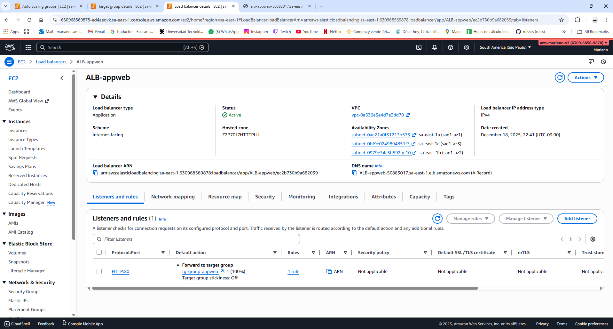
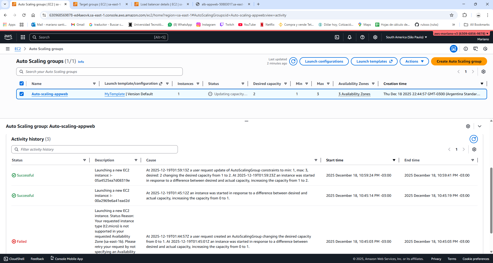
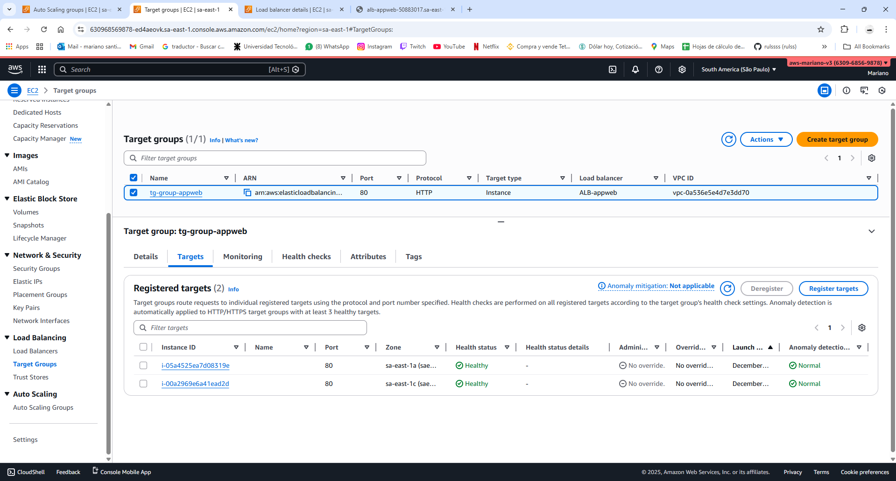
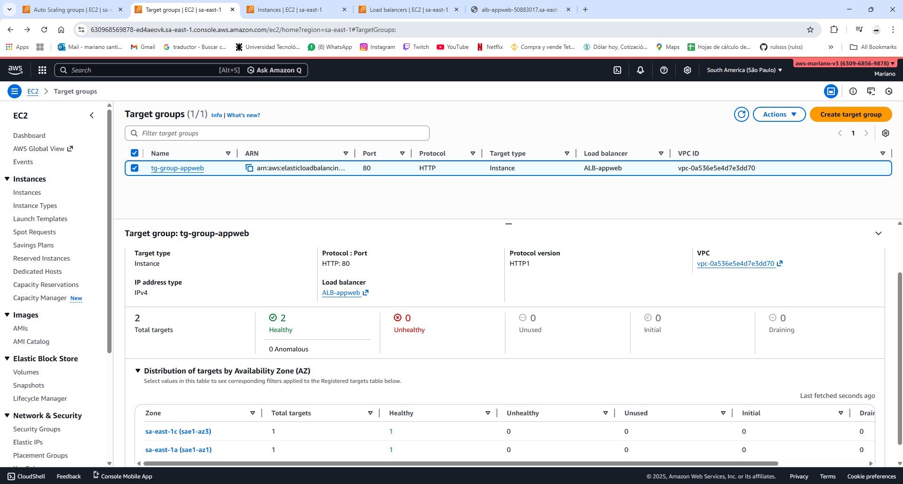

# Highly Available and Scalable Web Application

Hands-on lab from AWS Certified Solutions Architect Associate course (Stephane Maarek) – Scalability & High Availability module.

## Objective
Build a fault-tolerant and auto-scalable web architecture that:
- Is highly available across multiple Availability Zones
- Automatically scales based on load
- Gracefully handles instance terminations
- Distributes traffic intelligently

## Architecture Created
- VPC with public subnets in 2+ Availability Zones
- Internet Gateway
- 2+ EC2 instances (Amazon Linux 2) running Apache web server
- Auto Scaling Group (ASG) with:
  - Launch Template
  - Min: 2, Desired: 2, Max: 4
  - Scaling policy based on CPU utilization
- Application Load Balancer (Internet-facing) with:
  - Listener on port 80
  - Target Group with health checks
  - Sticky sessions enabled (duration-based)
  - Connection Draining (Deregistration Delay) configured
- Security Groups: ALB allows HTTP from internet, EC2 allows traffic only from ALB

## User Data Script (on EC2 instances)
See file `user-data.sh`

## Key Features Demonstrated
- Round-robin load distribution across instances and AZs
- Sticky sessions (session affinity via cookie)
- Cross-zone load balancing (enabled by default on ALB)
- Automatic scaling: tested by stressing CPU → new instance launched
- Graceful deregistration with Connection Draining
- High availability: traffic continues even if one AZ fails

## Screenshots

## What I Learned
- Types of Elastic Load Balancers (ALB, NLB, Gateway LB)
- Auto Scaling Groups, Launch Templates, and Scaling Policies
- Sticky sessions and when to use them
- Connection Draining / Deregistration Delay
- Cross-zone load balancing
- Building reliable and performant architectures following AWS Well-Architected principles