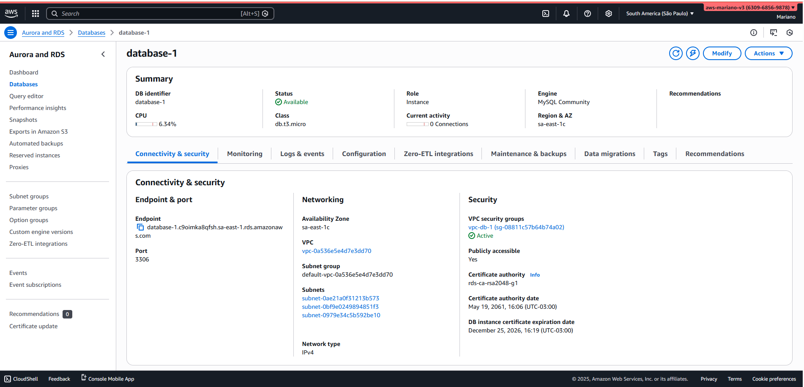
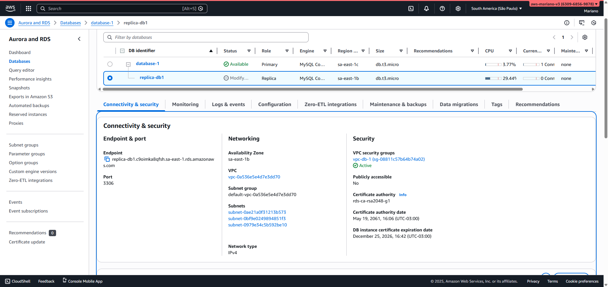
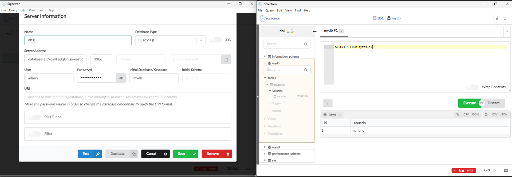
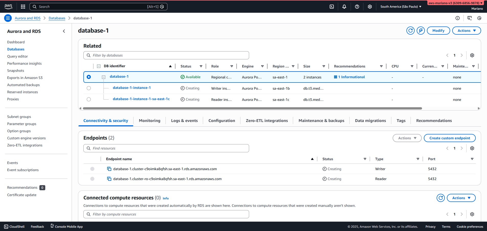

# RDS MySQL & Aurora Databases

Hands-on lab from the AWS Certified Solutions Architect Associate (SAA-C03) course by Stephane Maarek – Databases module.

This lab implements managed relational databases on AWS, focusing on cost optimization, read scaling, and understanding Aurora cluster endpoints.

## Architectures Created

## 1. RDS MySQL Instance (course-aligned)
- Engine: MySQL
- Deployment: Single-AZ (cost-optimized for learning and development)
- Instance class: db.t3.micro (Free Tier eligible)
- Fully configured for production template
- Self-managed master password
- Publicly accessible (for testing connectivity)
- Created in a new dedicated VPC
- Password authentication (default)
- Enhanced monitoring disabled
- Automated backups enabled (retention of 7 days) 

## 2. RDS Read Replica
- Created from the primary RDS MySQL instance
- Not publicly accessible (production best practice – only accessible within VPC)

## 3. Aurora MySQL Cluster
- Basic Aurora cluster created
- Writer instance and reader instance
- Cluster provides separate endpoints:
  - Writer endpoint: for write operations (INSERT, UPDATE, DELETE) and reads
  - Reader endpoint: for read-only operations (SELECT queries) – load balances across reader instances

## Database Operations Performed
- Successfully connected to the RDS MySQL primary instance using MySQL Workbench
- Endpoint, username, password, and default MySQL port (3306) used
- Executed the following queries:
  ```sql
  CREATE TABLE mytable (
      id SERIAL PRIMARY KEY,
      usuario VARCHAR(50) NOT NULL
  );

  INSERT INTO mytable (usuario) VALUES ('mariano');

  SELECT * FROM mytable;

- Verified table creation, data insertion, and retrieval

## Key Concepts Demonstrated
- Cost vs availability trade-offs (Single-AZ for development/testing)
- Read scaling using Read Replicas
- Aurora cluster architecture and endpoint strategy (writer vs reader)
- Secure networking best practices (private Read Replica)

## Screenshots
 
 
 
 

## I LearnedFull 
- RDS configuration options (instance class, networking, authentication, monitoring)
- Creating and managing Read Replicas for read scaling
- Aurora cluster benefits and endpoint routing (writer for modifications, reader for SELECTs)
- When to use public vs private access
- Standard MySQL client connectivity to AWS managed databases


